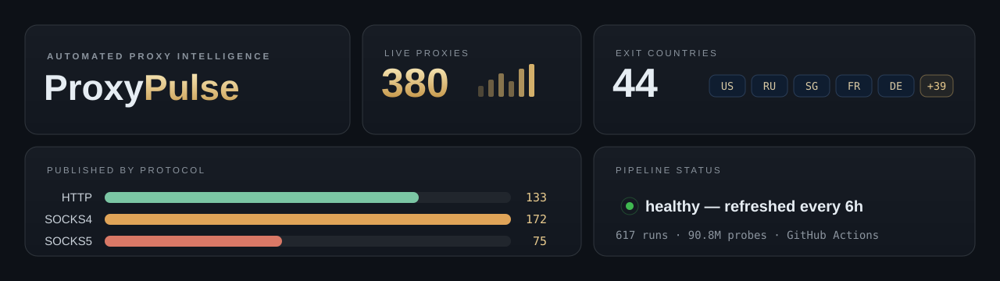

<h1 align="center">Proxy Pulse</h1>

Automated discovery, validation, and publishing of public proxy lists from GitHub repositories and gists.

  <strong><a href="https://blacksnowdot0.github.io/Proxy-Pulse/">📊 Live Dashboard</a></strong>
  &nbsp;•&nbsp;
  <strong><a href="all.txt">📦 Download Latest List</a></strong>

## ✨ Snapshot

| Metric | Value |
| --- | ---: |
| 🚦 Last run status | success |
| 🕒 Last generated | 2026-09-04T16:16:58Z |
| ✅ Last successful refresh | 2026-09-04T16:16:58Z |
| 🔁 Total runs | 682 |
| 🌐 Total outbound requests | 102668623 |
| 🧪 Total proxies checked | 94717170 |
| 📡 Total validated proxies | 637355 |

## 📂 Published Lists

| File | Description | Count |
| --- | --- | ---: |
| [http.txt](http.txt) | Validated HTTP proxies | 114 |
| [https.txt](https.txt) | HTTP proxies with CONNECT tunnel support | 29 |
| [socks4.txt](socks4.txt) | Validated SOCKS4 proxies | 175 |
| [socks5.txt](socks5.txt) | Validated SOCKS5 proxies | 55 |
| [all.txt](all.txt) | Combined scheme-qualified list | 344 |
| [stats.json](stats.json) | Machine-readable run database | 1 |
| [docs/data/dashboard.json](docs/data/dashboard.json) | Machine-readable dashboard dataset | 1 |
| [docs/data/proxies.json](docs/data/proxies.json) | Machine-readable validated proxy metadata | 344 |
| [sources.txt](sources.txt) | Discovered source file URLs | fresh each run |
| [data/sources.json](data/sources.json) | Discovered source database | capped at 2000 |
| [data/known-good.json](data/known-good.json) | Persistent proxy reliability state | rolling |

## ⚙️ Workflow

1. Search public GitHub repositories and gists using common proxy queries.
2. Scan .txt files and proxy-named text files for candidate host:port pairs.
3. Deduplicate candidates, split them across validation shards, and verify every proxy through two public IP-echo endpoints before enriching the surviving exit IP with country and anonymity metadata.
4. Merge shard results and regenerate the published lists, stats database, and this README.

## 📝 Notes

- Only proxies that pass the latest validation run are published.
- If a run finds zero valid proxies, the last known good published lists are preserved.
- Per-proxy metadata is published in docs/data/proxies.json while the root .txt lists stay scheme-focused.
- Public proxies are unstable; treat every entry as disposable infrastructure.
